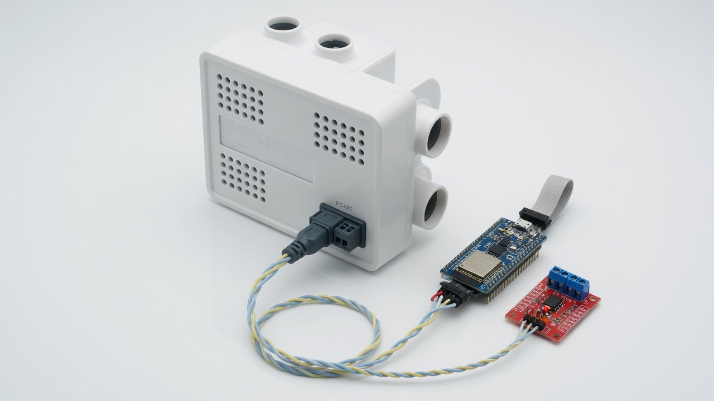
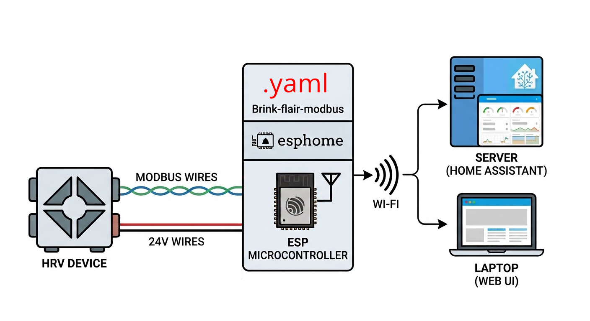
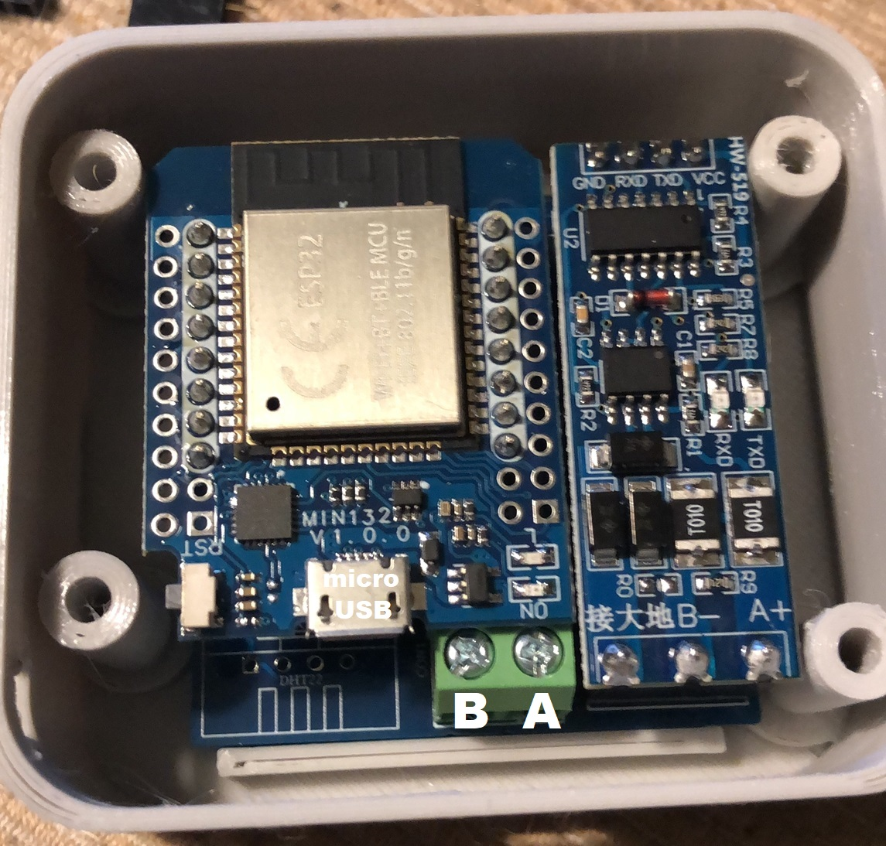
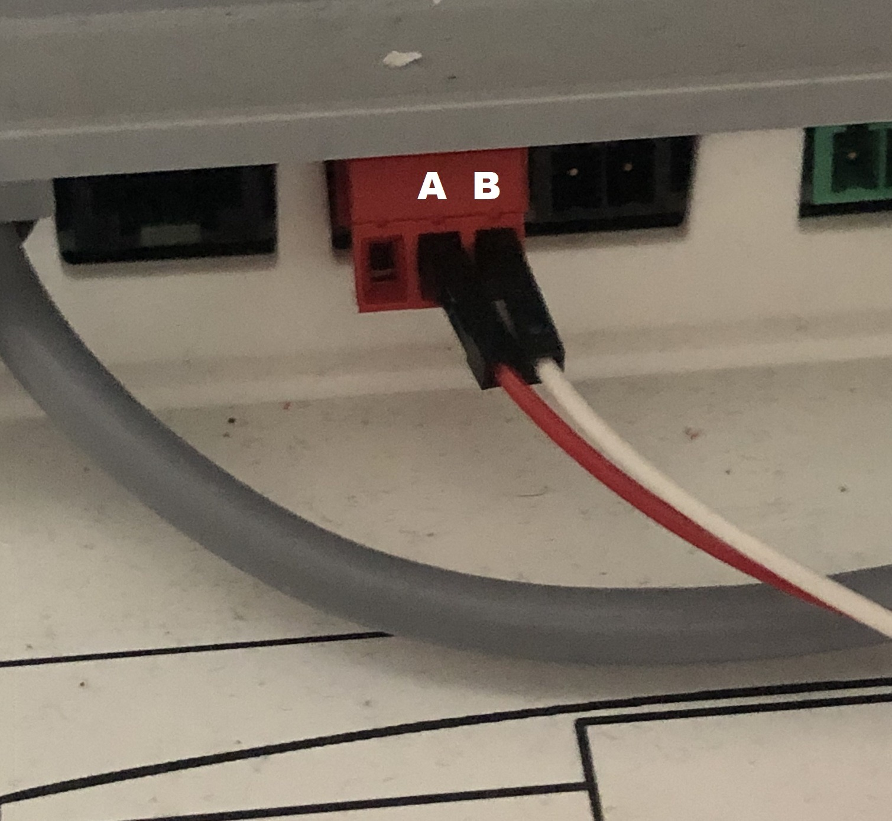
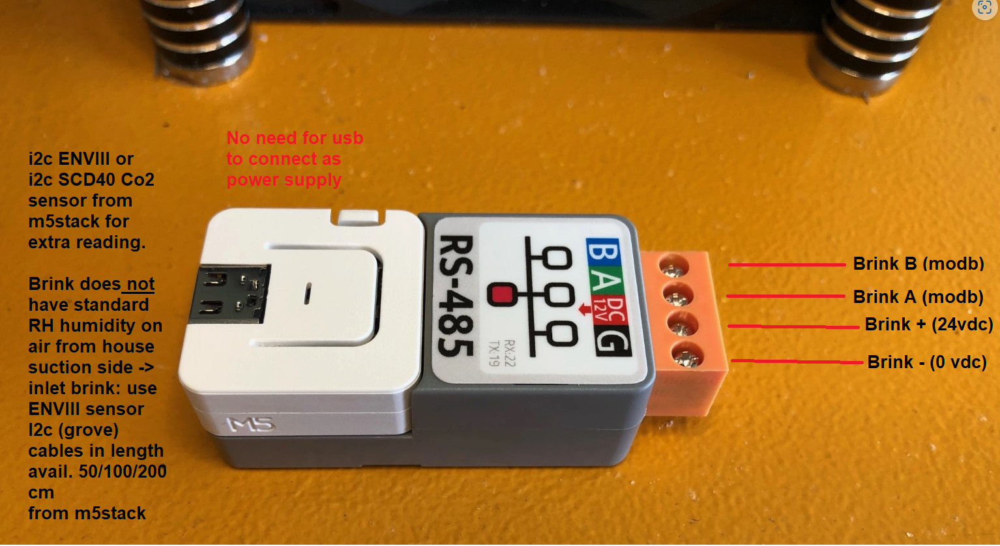

# ESP32 — Brink heat-recovery ventilator (Modbus RTU)

[ESPHome](https://esphome.io/) firmware to control a **Brink Flair / Renovent** heat-recovery ventilator (HRV) and clones over **Modbus RTU** from Home Assistant: airflow, bypass, frost protection, filters, temperatures.

<p align="center">
  
</p>

<p align="center">
  
</p>

---

## What it is for

The Brink 4-position wall controller is limited. Over Modbus you can:

- force airflow steps 0 / 1 / 2 / 3 (or a m³/h setpoint)
- open the **bypass** in summer (free cooling)
- track supply / extract temperature and humidity, pressures, dew point
- **dirty filter** alert and filter-hour reset
- frost protection, intake/exhaust imbalance
- standby

On boot the YAML sets the unit to **Modbus Step** (register 8000 = 1): the ESP is in charge, not the LCD. Disconnect the 4-position wall controller if the vendor requires it (both cannot command airflow at once).

---

## Hardware

| Part | Role | Link |
| --- | --- | --- |
| **Brink Flair 325 / 350 / 400** (or Renovent Excellent, rebadges) | HRV | [Brink Climate Systems](https://www.brinkclimatesystems.nl/) |
| **ESP32 DevKit** | Wi‑Fi + UART | — |
| **TTL → RS485** (MAX485 / XY-017, isolated if possible) | bus | [example ESP32+RS485 board](https://github.com/fonske/Brink-flair-modbus) |
| 2-wire A/B cable | Modbus | — |

Reference project: [fonske/Brink-flair-modbus](https://github.com/fonske/Brink-flair-modbus) · HA thread [Brink Flair 325 ESPHome](https://community.home-assistant.io/t/brink-flair-325-heat-recovery-unit-esphome-modbus-integration-5/423182).

<p align="center">
  
</p>

---

## Wiring

| Parameter | Value |
| --- | --- |
| Baud | **19200**, 8 bits, **even**, 1 stop |
| Slave | **20** (Brink default) |
| ESP32 TX | **GPIO17** |
| ESP32 RX | **GPIO16** |
| MAX485 A / B | HRV Modbus terminals |

<p align="center">
  
</p>

<p align="center">
  
</p>

*Photos: fonske/Brink-flair-modbus project.*

If the bus stays silent: swap A/B, try another RS485 module (cheap clones often fail), or check the termination resistor.

---

## ESPHome setup

1. Copy `esp32-modbus.yaml` + `secrets.yaml.example` → `secrets.yaml`.
2. API key: `openssl rand -base64 32`
3. Set `Flow 0…3` (m³/h) to **your** model (Flair 325 ≠ 400).
4. Flash:

```bash
esphome run esp32-modbus.yaml
```

5. Add the device in Home Assistant.

SNTP timezone is `Europe/Paris` (change it in the YAML).

---

## Main entities

| Group | Examples |
| --- | --- |
| Comfort | supply T° / RH, extract T°, outdoor air T°, dew point |
| Air | setpoint / actual m³/h, pressures Pa |
| Bypass | status, auto/open/closed, trigger temperatures, hysteresis, boost |
| Frost | status, preheater power, fan reduction |
| Filters | hours, days remaining, reset |
| Control | Modbus Step / Flow, preset 0–3, flow register 8002, standby |

`substitutions` at the bottom of the YAML are the Home Assistant labels.

---

## License

MIT — see `LICENSE`.
Brink / Flair / Renovent are trademarks of Brink Climate Systems.
Config inspired by community ESPHome Brink Modbus projects.
